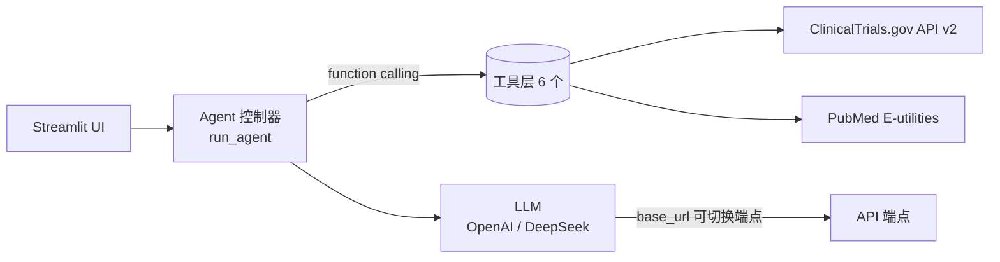

# 🏢 Pharma BD Competitive Intelligence Agent

> An AI Agent that helps pharma Business Development teams monitor competitor
> clinical pipelines, analyze therapeutic-area landscapes, and generate daily
> briefings — powered by ClinicalTrials.gov + PubMed and an LLM agent loop.

**🚀 Live Demo:** https://pharma-bd-agent-bkgjqphxzeyqe8nwqzaxgt.streamlit.app

## The Problem

Pharma BD teams spend 2–3 hours every morning manually checking
ClinicalTrials.gov for competitor updates. They need to know:

- What new trials did competitors file this week?
- How do competing pipelines compare by phase and indication?
- Which companies are entering a new therapeutic area?

This Agent automates that workflow end-to-end.

## What It Does

| Capability | Description |
|---|---|
| 🔍 Trial search | Search ClinicalTrials.gov by condition, sponsor/company, and status |
| 🗺️ Landscape analysis | Structured competitive report: sponsor grouping, phase distribution, LLM analysis |
| 📡 Change monitoring | Surface new / updated trials in the last N days (daily monitoring) |
| ⚖️ Side-by-side compare | Compare up to 5 trials on design, endpoints, competitive positioning |
| 📚 Literature context | Pull PubMed literature for mechanisms and targets |
| 🇨🇳 China pipeline | China sponsors + CDE approval lookup (ChiCTR / CDE portals) |

## Architecture


> 纯 function-calling 实现，无 Agent 框架依赖；通过 `DEEPSEEK_BASE_URL` 兼容任意 OpenAI 协议端点（默认 DeepSeek）。

### Agent Workflow

```
User: "What's new in NSCLC this week?"
  ↓
[1] monitor_recent_changes(condition="NSCLC", since_days=7)
  ↓
[2] LLM reads results, identifies notable changes by sponsor
  ↓
[3] If a competitor added multiple trials → analyze_competitive_landscape
  ↓
[4] Synthesizes a morning briefing: "本周亮点：AZ新增2项III期...默克进入..."
  ↓
Return structured report (in Chinese or English)
```

### Design Decisions

| Decision | Rationale |
|---|---|
| **No agent framework** | Pure OpenAI function calling. Demonstrates understanding of the underlying mechanism, not just how to drag nodes. |
| **ClinicalTrials.gov v2 advanced query** | Supports `AREA[Sponsor]` and `AREA[LastUpdatePostDate]RANGE` for sponsor filtering and time-based monitoring. |
| **Chinese output support** | The target users (Chinese pharma BD) operate in Chinese. Agent outputs in the user's language. |
| **Streamlit frontend** | Fast iteration, deployable to Streamlit Cloud for free. Preset buttons for common BD queries. |
| **Multi-model (DeepSeek / OpenAI 兼容)** | 通过 `.env` 配置 `DEEPSEEK_BASE_URL` + `DEEPSEEK_MODEL`，兼容任意 OpenAI 协议端点；默认 deepseek-chat。 |

## Quick Start

### 1. Install dependencies
```bash
pip install -r requirements.txt
```

### 2. Configure API Key (choose one)
- **Option A (recommended)**: Run `./run.sh` — it auto-generates `.env`, then fill in `DEEPSEEK_API_KEY` and re-run.
- **Option B**: Enter the API Key directly in the Streamlit sidebar (current session only, not saved).

### 3. (Optional) Use DeepSeek or any compatible endpoint
In `.env`:
```
DEEPSEEK_BASE_URL=https://api.deepseek.com
DEEPSEEK_MODEL=deepseek-chat
```
The sidebar also supports manual Base URL and custom model name — no code changes needed.

### 4. Launch
```bash
streamlit run app.py
```

Try queries like:

- "分析 NSCLC 的竞争格局"
- "过去一周 CAR-T 有什么新临床试验？"
- "AstraZeneca 在乳腺癌领域有什么布局？"

## Automated Daily Briefing (Email)

除了交互式 UI，项目还提供**无人值守的每日简报邮件推送**：定时抓取监控领域的近期变动，
结合竞争格局分析，自动生成 Markdown 简报并发送到指定邮箱。复用同一套工具层
（`monitor_recent_changes` + `analyze_competitive_landscape`），无需重写逻辑。

### 配置（`.env` 追加以下项，均不硬编码）

```bash
# 发件 SMTP（以 QQ 邮箱为例，密码填「授权码」而非登录密码）
SMTP_HOST=smtp.qq.com
SMTP_PORT=465
SMTP_USER=your_mail@qq.com
SMTP_PASSWORD=your_smtp_auth_code
EMAIL_TO=bd-team@company.com

# 监控领域（逗号分隔）与回溯天数
MONITOR_CONDITIONS=NSCLC,PD-1,ADC
MONITOR_SINCE_DAYS=7

# 每日发送时间（定时循环模式用，默认 08:00）
BRIEF_TIME=08:00
```

### 运行

```bash
# 立即跑一次并真正发邮件（测试）
python daily_brief_email.py --once

# 仅生成本地预览 HTML，不发送（无需配置 SMTP 也能看效果）
python daily_brief_email.py --dry-run

# 进入定时循环：每天 BRIEF_TIME 自动发送（依赖 schedule 库）
python daily_brief_email.py
```

### 定时触发（推荐用系统级任务，比进程常驻更稳）

- **macOS**：加载仓库内的 `com.pharmabd.dailybrief.plist`（launchd，每天 08:00 调 `--once`），
  先把文件里的 `/ABSOLUTE/PATH/TO/...` 替换成真实路径，再：
  ```bash
  cp com.pharmabd.dailybrief.plist ~/Library/LaunchAgents/
  launchctl load ~/Library/LaunchAgents/com.pharmabd.dailybrief.plist
  ```
- **Linux / 服务器**：`crontab -e` 加 `0 8 * * * /path/.venv/bin/python /path/daily_brief_email.py --once`
- **Windows**：任务计划程序，触发器设为每天 08:00，操作指向 `daily_brief_email.py --once`

> 内置「无变动不发送」逻辑：当所有监控领域在回溯窗口内均无新增/更新试验时，本次不发送邮件，避免每日空报到。

## Roadmap

- [ ] 演示 GIF / 截图（放进 README，增强可读性）
- [ ] 工具层单元测试
- [x] Email daily briefing delivery
- [ ] Slack / 钉钉 webhook 推送（与邮件并行）
- [ ] Personalized watchlist (track specific sponsors + conditions)
- [ ] Multi-source: add EU Clinical Trials Register, ChiCTR
- [ ] FastAPI + cron deployment for real monitoring

## License

MIT
