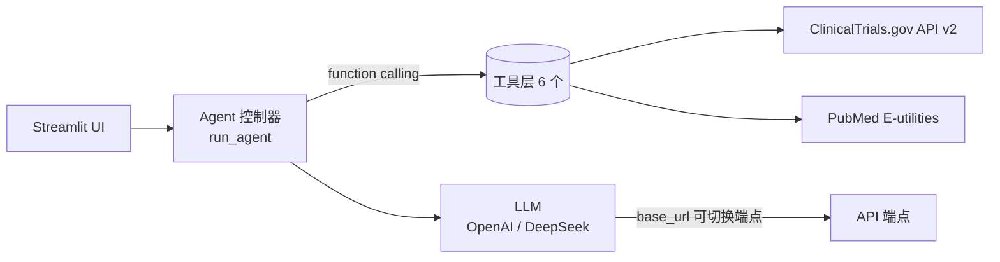

# 🏢 Pharma BD Competitive Intelligence Agent

> AI Agent for pharma BD professionals to monitor competitor pipelines,
> analyze clinical trial landscapes, and get daily briefings.
>
> Built for **Agent Engineer** and **AI Medical Product Manager** portfolio.
> Directly matches 丁香园 job requirement for 竞品监测Agent.

## The Problem

Pharma BD teams spend 2-3 hours every morning manually checking 
ClinicalTrials.gov for competitor updates. They need to know:

- What new trials did competitors file this week?
- How do competing pipelines compare by phase and indication?
- Which companies are entering a new therapeutic area?

This Agent automates that workflow end-to-end.

## Architecture


> 纯 function-calling 实现，无 Agent 框架依赖；通过 `DEEPSEEK_BASE_URL` 兼容任意 OpenAI 协议端点（默认 DeepSeek）。

### Tools

| Tool | Purpose |
|---|---|
| `search_clinical_trials` | Search by condition, sponsor/company, and status |
| `analyze_competitive_landscape` | Full landscape report: sponsor grouping, phase distribution, LLM analysis |
| `monitor_recent_changes` | Find new/updated trials in the last N days (daily monitoring) |
| `compare_trials_side_by_side` | Compare up to 5 trials on design, endpoints, competitive positioning |
| `get_trial_detail` | Full protocol for a specific NCT ID |
| `search_pubmed` | Scientific literature for context on mechanisms and targets |

### Agent Workflow

```
User: "What's new in NSCLC this week?"
  ↓
[1] monitor_recent_changes(condition="NSCLC", since_days=7)
  ↓
[2] LLM reads results, identifies notable changes by sponsor
  ↓
[3] If a competitor added multiple trials → analyze_competitive_landscape
  ↓
[4] Synthesizes a morning briefing: "本周亮点：AZ新增2项III期...默克进入..."
  ↓
Return structured report (in Chinese or English)
```

### Design Decisions

| Decision | Rationale |
|---|---|
| **No agent framework** | Pure OpenAI function calling. Shows I understand the underlying mechanism, not just how to drag nodes. |
| **ClinicalTrials.gov v2 advanced query** | Supports `AREA[Sponsor]` and `AREA[LastUpdatePostDate]RANGE` for sponsor filtering and time-based monitoring. |
| **Chinese output support** | The target users (Chinese pharma BD) operate in Chinese. Agent outputs in the user's language. |
| **Streamlit frontend** | Fast iteration, deployable to Streamlit Cloud for free. Preset buttons for common BD queries. |
| **Multi-model (DeepSeek / OpenAI 兼容)** | 通过 `.env` 配置 `DEEPSEEK_BASE_URL` + `DEEPSEEK_MODEL`，兼容任意 OpenAI 协议端点；默认 deepseek-chat。 |

## Quick Start

### 1. 安装依赖
```bash
pip install -r requirements.txt
```

### 2. 配置 API Key（二选一）
- **方式 A（推荐）**：复制 `.env.example` 为 `.env`，填入 `DEEPSEEK_API_KEY`
- **方式 B**：直接在 Streamlit 侧边栏输入 API Key（仅当前会话，不保存）

### 3. （可选）使用 DeepSeek 等兼容端点
在 `.env` 中设置：
```
DEEPSEEK_BASE_URL=https://api.deepseek.com
DEEPSEEK_MODEL=deepseek-chat
```
界面侧边栏同样支持手动填写 Base URL 与自定义模型名，无需改代码。

### 4. 启动
```bash
streamlit run app.py
```

试试这些查询：

- "分析 NSCLC 的竞争格局"
- "过去一周 CAR-T 有什么新临床试验？"
- "AstraZeneca 在乳腺癌领域有什么布局？"

## Portfolio Usage

### For Agent Engineer Interviews

- **Show the trace**: Open "Agent trace" — multi-step function calling with real clinical data.
- **Talk about tool design**: Why `monitor_recent_changes` does two API calls (new + updated), how `analyze_competitive_landscape` structures the data before calling LLM.
- **Mention the IP block workaround**: ClinicalTrials.gov blocks cloud IPs — the agent can use a local relay. Shows awareness of deployment constraints.

### For AI Medical Product Interviews

- **User story**: "Pharma BD needs daily competitor monitoring — this agent saves 2+ hours/day."
- **Market fit**: Directly maps to real job requirements (丁香园 竞品监测Agent).
- **Evaluation metrics**: Coverage (missed trials), timeliness (within 24h of posting), accuracy of competitive analysis.
- **Business model**: Pharma companies pay for CI tools. This could be a SaaS product.

## Roadmap

- [ ] 演示 GIF / 截图（放进 README，增强作品可读性）
- [ ] 工具层单元测试
- [ ] Email/Slack daily briefing delivery
- [ ] Personalized watchlist (track specific sponsors + conditions)
- [ ] Multi-source: add EU Clinical Trials Register, ChiCTR
- [ ] FastAPI + cron deployment for real monitoring

## License

MIT
